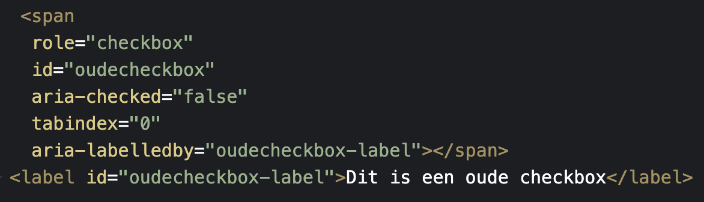
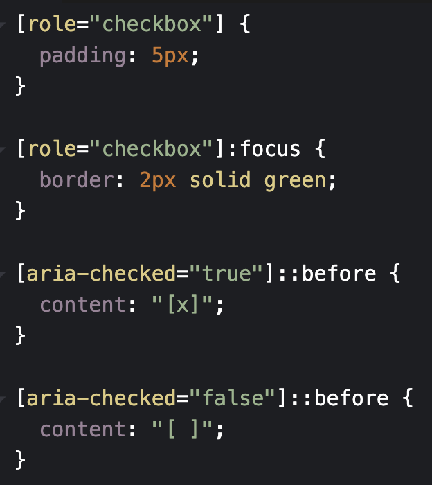
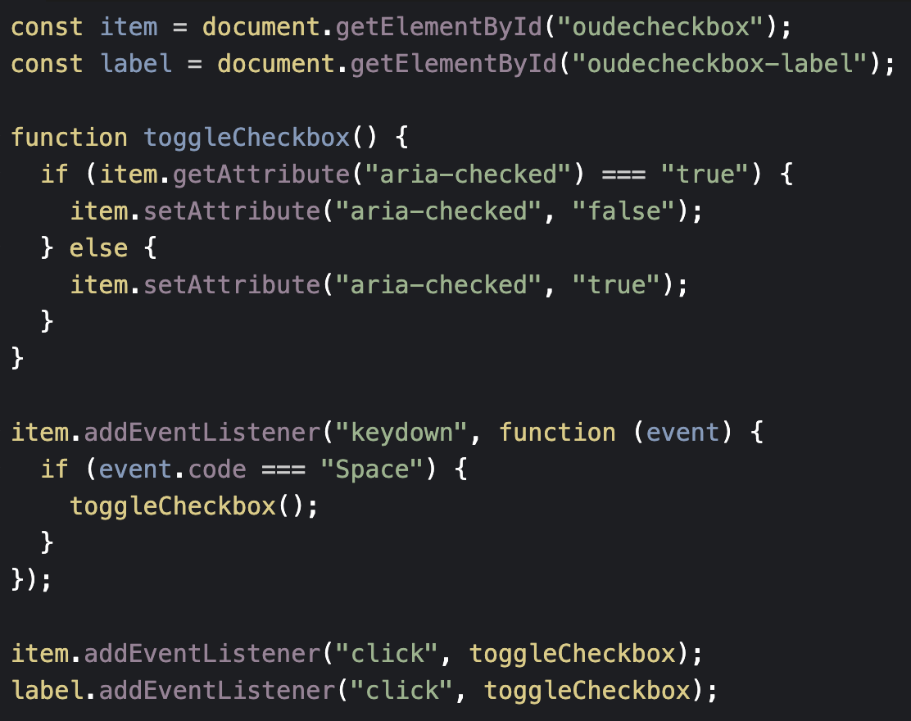
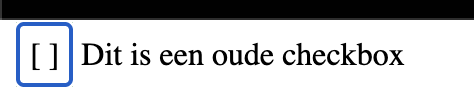
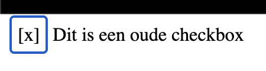
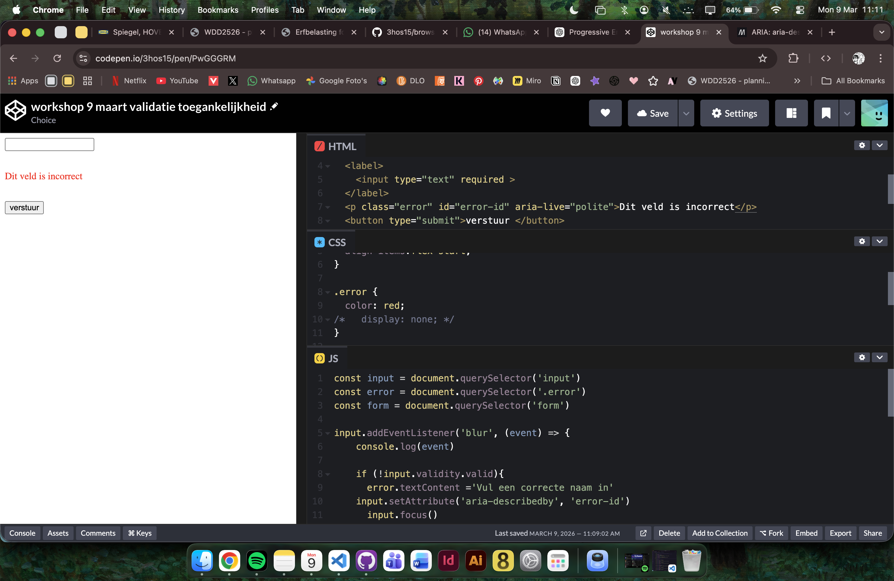

Ik wilde graag bij input type date als value alleen het jaar (dus dd/mm/2026) maar hier is helaas geen mogelijkheid voor. Vasilis gaf als tip, maak met javascript je eigen input.

# Reflectie Minor Web

## Dagelijkse vragen

**Wat heb ik vandaag gedaan:**
**Hoelang duurde het:**
**Wat heb ik geleerd:**
**Wat ga ik morgen doen:**

---

## Week 3

### Dag 1 – maandag 16 feb
**Wat heb ik vandaag gedaan:**
Hoorcollege over formulieren gevolgd en begonnen aan HTML voor het formulier erfbelasting. De eerste pagina van het formulier staat erin.

**Hoelang duurde het:**
Heledag goed bezig geweest

**Wat heb ik geleerd:**
Veel over formulieren
* Fieldset
* Legends
* Attributes
* Nieuwe info input types

**Wat ga ik morgen doen:**
Verder aan formulier, onderzoeken ns vormgeving en beginnen aan vormgeven

---

### Dag 2 - dinsdag 17 feb

**Wat heb ik vandaag gedaan:**
weekly geek
workshop van victor

styling en javascript 

**Hoelang duurde het:**
De heledag naast pauze (vandaag zat ik er wel een beetje doorheen)

**Wat heb ik geleerd:**
Read only in html en css

**Wat ga ik morgen doen:**
verder werken aan de styling, skip naar vraag 1b etc
2e pattern er in en CSS kickoff

---

### Reflectie Week 3

Deze week stond grotendeels in het teken van het opzetten, uitwerken en begrijpen van formulieren binnen HTML, in combinatie met styling en de eerste stappen richting interactie met JavaScript. Aan het begin van de week lag mijn focus vooral op de technische basis: het correct structureren van een formulier en het toepassen van semantische HTML. Door het hoorcollege kreeg ik beter inzicht in waarom onderdelen zoals fieldset en legend belangrijk zijn, niet alleen voor overzicht in de code maar ook voor toegankelijkheid en gebruiksvriendelijkheid.

Tijdens het bouwen van de eerste pagina van het formulier merkte ik dat ik steeds bewuster keuzes begon te maken. Waar ik eerder vooral keek naar of iets ‘werkt’, denk ik nu meer na over structuur, schaalbaarheid en hoe een gebruiker door het formulier heen navigeert. Dit was soms uitdagend, omdat het erfbelastingformulier inhoudelijk complex is, maar juist daardoor leerzaam.

De Weekly Geek en de workshop van Victor waren een goede aanvulling op mijn eigen werk. Deze momenten zorgden ervoor dat ik mijn aanpak kon spiegelen aan voorbeelden en best practices. Vooral het onderwerp readonly inputs liet me nadenken over hoe je met kleine technische keuzes veel duidelijkheid kunt creëren voor de gebruiker. Ook werd het voor mij duidelijker hoe CSS niet alleen een esthetische functie heeft, maar ook kan bijdragen aan begrijpelijkheid en hiërarchie.

Halverwege de week merkte ik dat mijn energie wat lager lag. Ondanks dat heb ik toch doorgewerkt, zij het in een iets lager tempo. Dit maakte me bewust van het belang van realistische planning en het nemen van korte pauzes om focus te behouden. Tegelijkertijd ben ik tevreden dat ik, ondanks deze dip, vooruitgang heb geboekt en de basis van het formulier steeds sterker werd.

Wat ik deze week vooral heb geleerd, is dat vormgeving, techniek en gebruikerservaring sterk met elkaar verbonden zijn. Kleine aanpassingen in CSS of HTML kunnen een groot verschil maken in hoe logisch en prettig een formulier aanvoelt. Volgende week wil ik hier verder op voortbouwen door eerder te testen, feedback te verzamelen en mijn keuzes beter te onderbouwen. Daarnaast wil ik efficiënter omgaan met mijn tijd, zodat ik mijn energie beter kan verdelen over de week.

---

### week 4

### Dag 4 - maandag 2 maart

**Wat heb ik vandaag gedaan:**
Workshop gevolgd over validation met alleen css. Gewerkt aan erfbelasting formulier. Ingelezen over de weekly geek en begonnen aan een voorbeeld

**Hoelang duurde het:**
-

**Wat heb ik geleerd:**
Hoe ik met  alleen html en css een formulier kan valideren

**Wat ga ik morgen doen:**
De weekly geek opdracht met het groepje maken. Workshop volgen en verder werken aan BT. Extra informatie formulier toepassen (aside)?

### Dag 5 - dinsdag 3 maart

**Wat heb ik vandaag gedaan:**
**Weekly geek**
Voor de weekly geek heb ik met mijn groepje radio buttons en checkboxen onderzocht. We hebben gekeken naar hoe je ze zelf kan maken dmv divs en spans. Ik had gekeken naar de checkboxes, hiervoor moet je de volgende dingen in je HTML, CSS en Javascript zetten:

De checkbox kan je bedienen door te tabben en op space te drukken, ook hebben we toegevoegd dat je ook er op kan klikken.
Zo ziet het eruit:

De javascript code was nogal lastig om te begrijpen, zeker voor de radiobuttons want die kregen we niet te werken.

* Workshop valideren in javascript van Victor aantekeningen:

if(nameField.value == repeatNameField.value) {
    console.log('komt overeen')  
    }
    else {
        repeatNameField.setCustomValidity('Veld komt niet overeen met naam')
        console.log('komt niet overeen')
    }

repeatNameField.addEventlistener('blur', event=> {
    if(nameField.value == repeatNameField.value) {
    console.log('komt overeen')  
    }
    else {
        repeatNameField.setCustomValidity('Veld komt niet overeen met naam')
        console.log('komt niet overeen')
    }
})

console.log(false === '0') - altijd === gebruiken, dit is stricter.

een p tag met error toevoegen en die stylen in css als de input invalid is, geeft niet veel voor accesability/screenreader - aria-live=polite etc.

Custom validity resetten met ("") in de if statement (het wordt altijd geparsed naar een string ook als je het niet tussen haakjes zet)

Als javascript uit staat moet je formulier nogsteeds kunnen werken

MDN validity state

**Hoelang duurde het:**
De hele dag naast workshops en pauzes 
**Wat heb ik geleerd:**
Valideren met javascript

**Wat ga ik morgen doen:**

---

### week 5

---

### Dag 6 - maandag 9 maart

**Workshop van Victor**  
https://codepen.io/3hos15/pen/PwGGGRM  
  

Herhaling user-invalid. Geleerd over aria-live="polite" en aria-describedby attributen in javascript

https://developer.mozilla.org/en-US/docs/Web/Accessibility/ARIA/Reference/Attributes/aria-describedby

**Gesprek BT ingehaald**
progessive disclore meerdere html
informatie vragen
validatie toevoegen
wat is echt handig?

**Weekly geek**  
De video gebruikt de metafoor van “twee wolven in jezelf” om het conflict te beschrijven tussen webgebruikers en webdesigners.

Adrian staat voor de gebruiker: die wil dat websites duidelijk, herkenbaar en makkelijk te gebruiken zijn.

Chris staat voor de designer: die wil innoveren en dingen anders doen, vaak om origineel te lijken.

Het probleem ontstaat wanneer designers bestaande interface conventies veranderen terwijl die eigenlijk prima werken voor gebruikers. Daardoor wordt een interface moeilijker te begrijpen.

Voorbeelden:

Hyperlinks: designers verwijderen vaak de onderstreping, terwijl die juist helpt om links te herkennen.

Text inputs (formuliervelden): designers halen lijnen en labels weg om het design minimalistisch te maken.

Wanneer labels verdwijnen ontstaan nieuwe problemen:

Het is onduidelijk waar je tekst moet invoeren.

Designers plaatsen labels vervolgens als placeholder in het veld, wat verwarrend is omdat:

* placeholders verdwijnen zodra je typt,

* ze eruit kunnen zien als ingevulde tekst,

* ze niet meer gebruikt kunnen worden voor voorbeelden.

Zelfs grote systemen zoals Material Design van Google namen deze aanpak over, maar onderzoek liet later zien dat gebruikers de lijnen onder inputvelden verwarren met gewone scheidingslijnen.

De uiteindelijke oplossing die vaak wordt gebruikt (floating labels) is volgens de tekst een onnodig complexe oplossing voor een probleem dat nooit bestond.

Key points:

Er is een spanningsveld tussen gebruiksvriendelijkheid (gebruikers) en innovatie (designers).

Veel designbeslissingen breken bestaande webconventies die juist helpen bij usability.

Voorbeelden van slechte “innovatie”:

* onderstrepingen bij links verwijderen

* minimalistische text inputs zonder duidelijke labels

Placeholders als labels veroorzaken verwarring en verminderen functionaliteit.

Grote designsystemen hebben deze patronen verspreid ondanks usability problemen.

De simpelste en beste oplossing: houd duidelijke labels boven inputvelden en respecteer bestaande conventies.

Mijn mening:

Ik vond het een interessante video, zeker met de animatie en.. taal gebruik. Het idee dat als je als designer wilt "afwijken" van het origineel komt me bekend voor. We willen altijd nieuwe dingen maken, maar in realiteit is bijna niks echt nieuw. Bij bepaalde dingen zoals text input en placeholder ben ik het er wel mee eens dat het het beste is om je aan het "origineel" aspect te houden. Mensen die niet veel ervaring hebben met het web kunnen moeite hebben met de (bijv.) innovatieve text input, dit maakt het gebruiken van je gemaakte website niet fijn voor de gebruikers. Ik denk dat ik zelf tussen de twee wolven zit. Ik wil graag innovatief zijn maar ik hou me wel aan bepaalde "regels" die het web fijn maken voor de gebruikers.